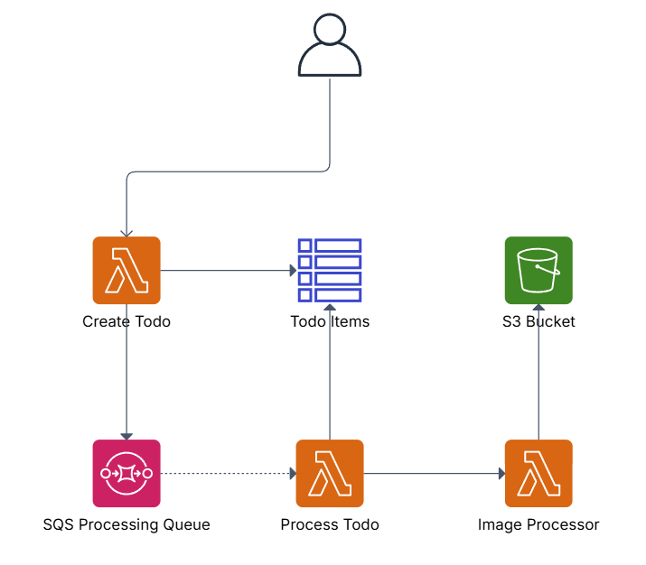
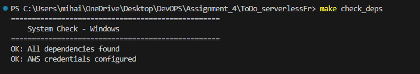
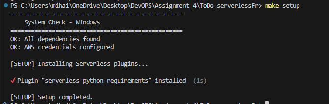
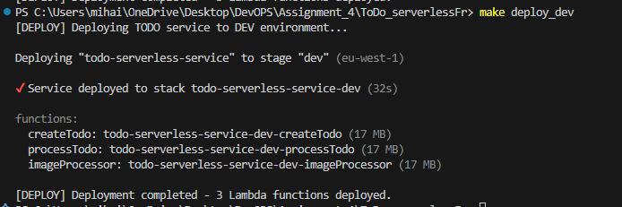
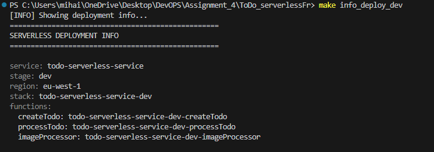
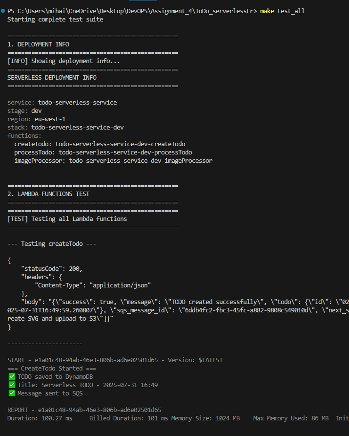
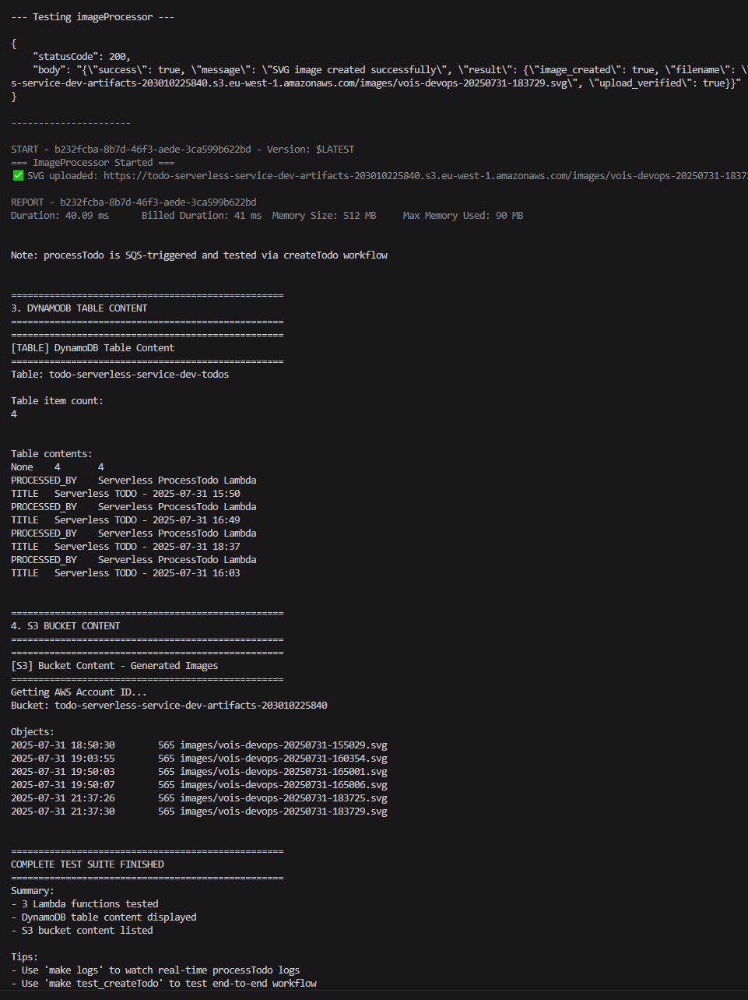
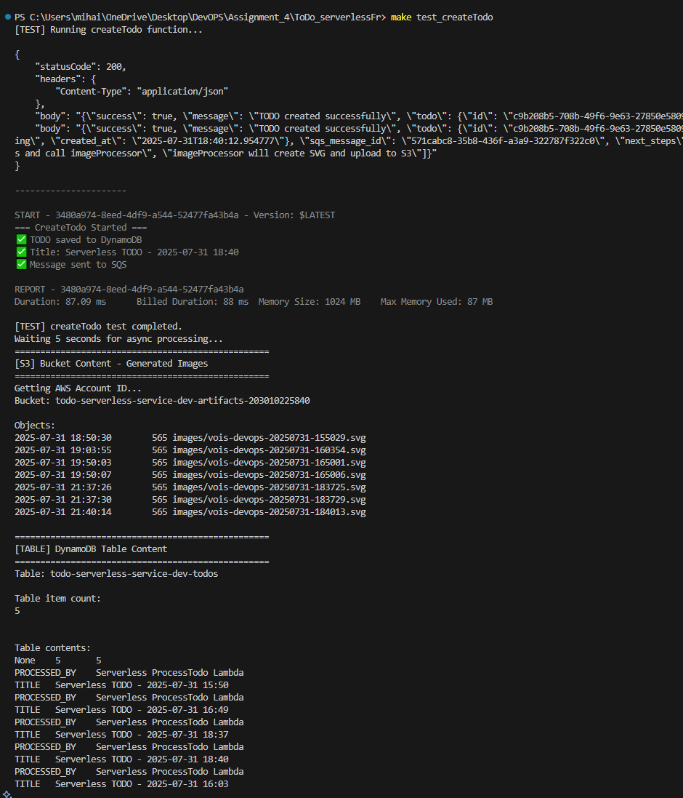
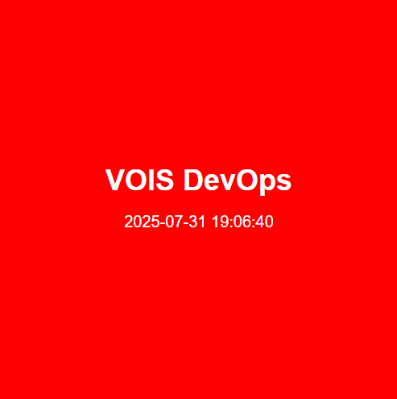

# Serverless TODO Service

A fully serverless TODO management system built with AWS Lambda, DynamoDB, SQS, and S3. This project demonstrates modern serverless architecture patterns, event-driven processing, asynchronous workflows, and automated image generation.

## 🏗️ Architecture Overview

```
```

```

```
### Simple Flow
1. **Manual Trigger** → Creates TODO in DynamoDB + sends to SQS
2. **SQS Queue** → Triggers processTodo with TODO data
3. **processTodo** → Updates status + calls imageProcessor
4. **imageProcessor** → Creates red SVG with white text → uploads to S3


## 🛠️ Technologies Used

- **Framework**: Serverless Framework 4.17.1
- **Runtime**: Python 3.13
- **Cloud Provider**: AWS (eu-west-1)
- **Services**:
  - AWS Lambda (3 functions)
  - Amazon DynamoDB (NoSQL database)
  - Amazon SQS (Message queuing)
  - Amazon S3 (Object storage)
- **Build Tools**: Make, Python

## 📋 Prerequisites

Before running this project, ensure you have:

- [AWS CLI](https://aws.amazon.com/cli/) installed and configured
- [Serverless Framework](https://www.serverless.com/) installed globally: `npm install -g serverless`
- [Node.js](https://nodejs.org/) (for Serverless Framework)
- [Python 3.13](https://www.python.org/) 
- [Make](https://www.gnu.org/software/make/) 

## 🚀 Quick Start

### 1. Replace placeholders in config files
```yaml
# conf/dev.yml

vpcId: vpc-PLACEHOLDER-DEV
privateSubnetIds:
  - subnet-PLACEHOLDER-DEV
```

### 2. Check Dependencies
```bash
make check_deps
```


### 3. Install Serverless Plugins
```bash
make setup
```


### 4. Deploy to Development
```bash
make deploy_dev
```


### 5. View Deployment Info
```bash
make info_deploy_dev
```


### 6. Test all functions and show data
```bash
make test_all
```



### 7. Test the Application
```bash
make test_createTodo
```


## 📖 Available Commands

| Command | Description |
|---------|-------------|
| `make hello` | Show all available commands |
| `make check_deps` | Check system dependencies |
| `make setup` | Install serverless plugins |
| `make deploy_dev` | Deploy to dev environment |
| `make test_createTodo` | Test createTodo function |
| `make test_functions` | Test all Lambda functions |
| `make test_all` | Complete test suite |
| `make show_table` | Show DynamoDB table content |
| `make show_s3` | Show S3 bucket content |
| `make logs` | Watch processTodo logs |
| `make clean_data` | Clean S3 and DynamoDB data |
| `make remove_dev` | Remove dev deployment |

## 🔧 Lambda Functions

### 1. createTodo
- **Purpose**: Creates new TODO items
- **Trigger**: Manual invoke
- **Timeout**: 10 seconds
- **Actions**: 
  - Generates UUID and timestamp
  - Creates TODO item
  - Saves TODO to DynamoDB
  - Sends message to SQS for processing

### 2. processTodo
- **Purpose**: Processes TODO items from SQS
- **Trigger**: SQS messages (batch size: 5)
- **Timeout**: 30 seconds
- **Actions**:
  - Updates TODO status to "processed"
  - Adds processing timestamp
  - Triggers image creation

### 3. imageProcessor
- **Purpose**: Creates branded SVG images
- **Trigger**: Invoked by processTodo
- **Timeout**: 45 seconds
- **Memory**: 512MB
- **Actions**:
  - Creates red SVG (500x500px)
  - White text: "VOIS DevOps" + timestamp
  - Uploads to S3 bucket

## 📁 Project Structure

```
├── makefile                # Cross-platform build commands
├── serverless.yml          # Serverless Framework configuration 
├── requirements.txt        # Python dependencies
├── create_todo.py          # Create TODO Lambda function
├── process_todo.py         # Process TODO Lambda function
├── image_processor.py      # Image creation Lambda function
├── dev.yml                 # Development environment config
├── stage.yml               # Staging environment config
├── prod.yml                # Production environment config
└── .gitignore              # Git ignore rules
```

## 🌐 AWS Resources Created

The deployment creates the following AWS resources:

- **DynamoDB Table**: `todo-serverless-service-{stage}-todos`
- **SQS Queue**: `todo-serverless-service-{stage}-processing`
- **S3 Bucket**: `todo-serverless-service-{stage}-artifacts-{accountId}`
- **Lambda Functions**: 3 functions with appropriate IAM roles

## 🧪 Testing

### Test Individual Function
```bash
# Test TODO creation (includes full workflow)
make test_createTodo

# Test all functions
make test_functions
```

### View Data
```bash
# Show DynamoDB content
make show_table

# Show S3 bucket content
make show_s3
```

### Monitor Logs
```bash
# Watch real-time logs (createTodo)
make logs
```

### Complete Test Suite
```bash
# Run comprehensive tests
make test_all
```

## 🔒 Security & Permissions

The application uses IAM roles with minimal required permissions:
- DynamoDB: Read/Write access to TODO table
- SQS: Send/Receive messages from processing queue
- S3: Read/Write access to artifacts bucket
- Lambda: Invoke other Lambda functions

## 🎯 TODO Object Structure

**Ultra-simplified with only 5 essential fields:**

```json
{
  "id": "uuid4-generated-string",
  "created_at": "2025-01-30T15:42:33.123Z",
  "title": "Serverless TODO - 2025-01-30 15:42",
  "description": "Created with simplified Serverless Framework approach - clean and efficient",
  "status": "pending"
}
```

## 🎨 Generated Images

- **Format**: SVG (500x500px)
- **Background**: Red
- **Text Color**: White
- **Content**: "VOIS DevOps" + timestamp
- **Storage**: S3 



## 🌍 Multi-Environment Support

Deploy to different environments:

```bash
# Development
serverless deploy --stage dev

# Staging  
serverless deploy --stage stage

# Production
serverless deploy --stage prod
```

## 🧹 Cleanup

To remove S3 and DynamoDB data:
```bash
make clean_data
```

To remove all resources:
```bash
make remove_dev
```

## 🐛 Troubleshooting

### Common Issues

1. **AWS Credentials**: Ensure AWS CLI is configured: `aws configure`
2. **Serverless Framework**: Install globally: `npm install -g serverless`
3. **Dependencies**: Run `make check_deps` to verify all requirements
4. **Region Issues**: Default region is `eu-west-1`, modify in `serverless.yml` if needed

### Debug Commands
```bash
# Check deployment info
make info_deploy_dev

# View logs
make logs

# Check S3 bucket
make show_s3

# Verify DynamoDB table
make show_table
```

---

